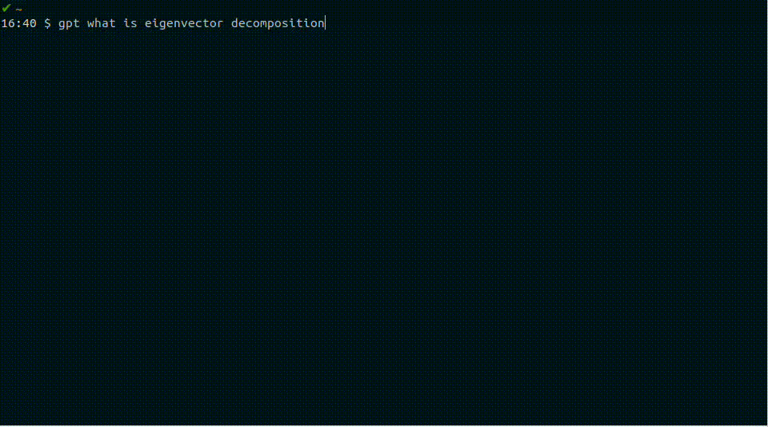

# Teeny Tiny GPT-4 CLI Wrapper



# Bash Functions provided:

- gpt: Ask GPT-4 a question
- dalle: Ask DALL-E 3 to generate an image
- pex: Explain the technical terms and jargon in the contents of your clipboard (requires xclip)

[Pricing](https://openai.com/pricing):

- GPT-4 Turbo: $10.00 / 1M tokens ~= 0.25c per 1024 characters
- DALL-E 3: 12c USD / image

## Local setup

```bash
python3 -m venv venv
. ./venv/bin/activate
pip install -r requirements.txt
```

.bashrc:

```bash
export OPENAI_API_KEY="sk-XXXXXXXX"
export DALLE_IMAGE_OPENER="google-chrome"
export GPT_HOME="/home/myname/code/gpt
. $GPT_HOME/funcs.sh
```
